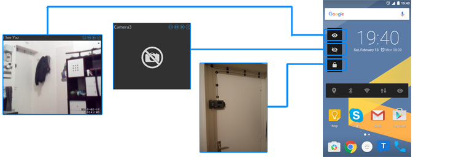
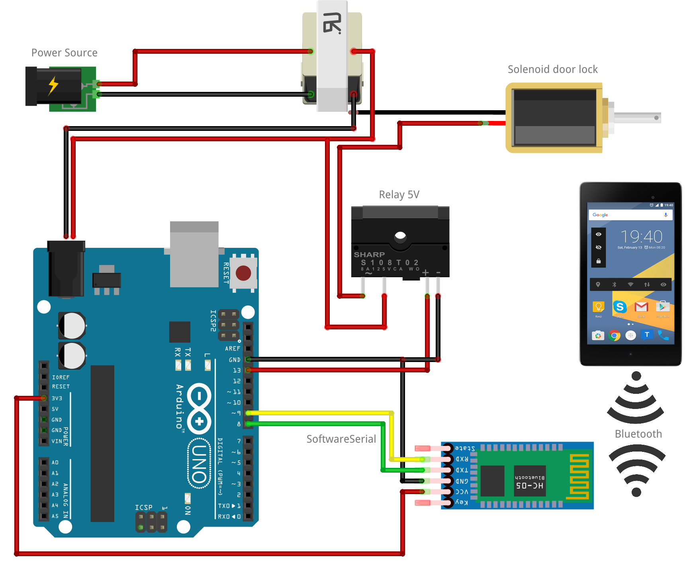

# HomeManager

HomeManager is an Android client which unlock my arduino powered door via bluetooth and my raspberry pi security camera via internet. For now.

## Components

Three main components in HomeManager for now :

- __`client`__ - Android widget client to control the security system
- __`door`__ - Arduino bluetooth server controlling the door lock
- __`motioneye`__ - patch for the raspberry pi OS to control the system via an API

## Client process
The Android client is a simple widget used to control the door and camera, the application in itself is a blank UI.

## Schematic
- JY-MCU for bluetooth
- Relay 5V
- Solenoid door lock
- Arduino UNO
- Transformer 9V

